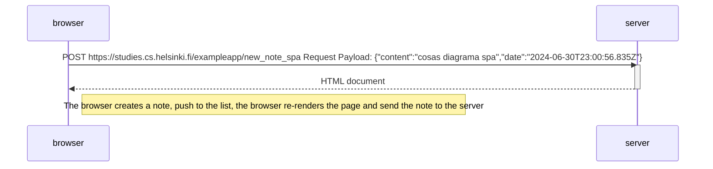

```mermaid
sequenceDiagram
    participant browser
    participant server

    browser->>server: POST https://studies.cs.helsinki.fi/exampleapp/new_note_spa Request Payload: {"content":"cosas diagrama spa","date":"2024-06-30T23:00:56.835Z"}
    activate server
    server-->>browser: HTML document
    deactivate server

    Note right of browser: The browser creates a note, push to the list, the browser re-renders the page and send the note to the server

```